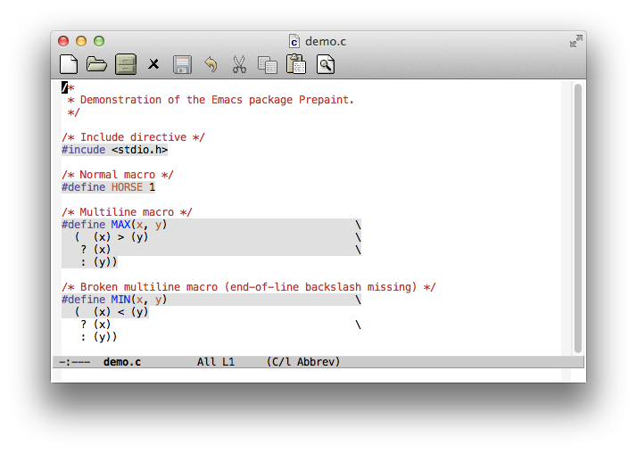

# prepaint - Highlight C-style preprocessor directives

*Author:* Anders Lindgren 
*Version:* 0.0.1 
*URL:* [https://github.com/Lindydancer/prepaint](https://github.com/Lindydancer/prepaint) 

*Prepaint* is an Emacs package that highlight C-style preprocessor
directives. The main feature is support for macros that span
multiple lines.

Prepaint is implemented as two minor modes: `prepaint-mode` and
`prepaint-global-mode`. The former can be applied to individual
buffers and the latter to all buffers.

## Usage

Place the source file in a directory in the load path. Add the
following lines to an appropriate init file:

       (require 'prepaint)

Activate this package by Customize, or by placing the following line
into the appropriate init file:

       (prepaint-global-mode 1)

This package use Fone Lock mode, so `font-lock-mode` or
`global-font-lock-mode` must be enabled (which it is by default).

## Example

Below is a screenshot of a sample C file, demonstrating the effect
of this package:

---
Converted from `prepaint.el` by [*el2markup*](https://github.com/Lindydancer/el2markdown).
